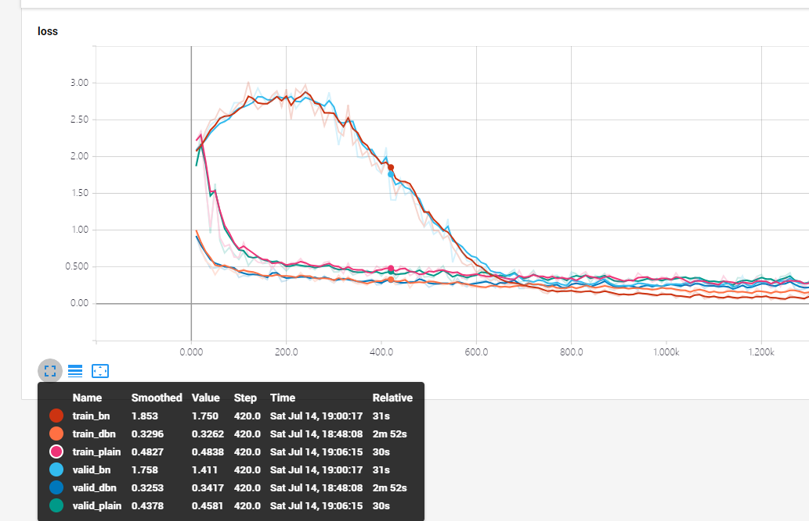

# Decorrelated Batch Normalization
An implementation of DecorrelatedBN by tensorflow


This implementation is based on papers: 
<b>Decorrelated Batch Normalization</b> (https://arxiv.org/abs/1804.08450) 
from Lei Huang, Dawei Yang, Bo Lang, Jia Deng.

### Running experiments
```buildoutcfg
python vgg.py --type=A --batch=256 --lr=0.1 --method=dbn --m=0
```

recent result on cnn:

</img>


### Reference
More deteils please refer to the torch edition by Huang Lei 
- [umich-vl/DecorrelatedBN](https://github.com/umich-vl/DecorrelatedBN)


